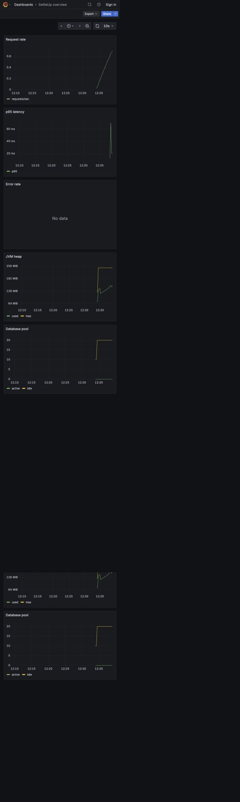

# SettleUp

SettleUp is an expense-sharing application for friend groups. It will connect to a bank account, find transactions that may belong to a group, show each member's balance, and suggest payments to settle the group.

## Project status

Phases 0–13 are complete: 14 of 16 planned phases, or 87.5% of the phase roadmap. Progress is counted only from completed phase gates, not partially implemented work from later phases.

- Phases 0–2: local tooling, Spring Boot and PostgreSQL setup, Flyway migrations, and core domain entities
- Phases 3–4: group membership, shared expenses, equal/exact/percentage splits, balances, settlement plans, and recorded payments
- Phase 5: account registration and login, BCrypt password hashing, signed JWT access tokens, authenticated user identity, and protected APIs
- Phase 6: Plaid Link, encrypted bank credentials, account discovery, cursor-based transaction sync, verified webhooks, and transaction-to-expense conversion
- Phase 7: React authentication and protected routing; a Plaid-first transaction feed; transaction-to-group sharing; friend groups, balances, suggested settlements, and manual fallback expenses; plus the conceptual-sketch landing experience and scroll-linked phone-circle story
- Phase 8: rule-based transaction classification using merchant history, category, and typical amounts; a confidence-gated suggestion inbox; confirm/reject endpoints; and negative feedback that suppresses repeated bad suggestions
- Phase 9: a 35-test integration suite against a shared Testcontainers PostgreSQL 16 instance, including authentication, authorization, expenses, settlements, Plaid webhook idempotency, and suggestion decisions
- Phase 10: a cached multi-stage, non-root API image and health-gated Docker Compose stack; the runtime image is approximately 261 MiB
- Phase 11: a three-node local kind deployment with Kustomize, two API replicas, PostgreSQL persistent storage, ingress, health probes, resource controls, metrics-server, and CPU autoscaling from 2–5 replicas
- Phase 12: a production-ready, mobile-first React UI with cached server state, validated equal/exact/percentage splits, Plaid Link, a suggestion inbox, automatic token renewal, and complete loading, error, and empty states
- Phase 13: PR CI, GHCR image publication and optional cluster deployment, Prometheus metrics, a provisioned Grafana dashboard, structured JSON logs, and request correlation IDs

Work continues strictly in phase order. Phase 14 is optional and incurs AWS cost; Phase 15 is the final shipping pass. See `settleup-build-spec.md` for their acceptance gates.

## Tech stack

- Java 21 and Spring Boot 3 for the backend
- PostgreSQL 16 and Flyway for data and database migrations
- Plaid Sandbox for bank account data
- Docker for local services and app containers
- Kubernetes, kind, and Helm for local deployment work
- React, Vite, TypeScript, Fluent UI, Radix UI, Drawably, and GSAP for the frontend

## Setup

This project uses macOS and Homebrew for local tool installation.

```bash
git clone https://github.com/jason3012/payUp.git settleUp
cd settleUp
npm run setup
npm run phase0:check
```

`npm run setup` installs the tools listed in the `Brewfile`.

Create a local environment file:

```bash
cp .env.example .env
```

Generate a JWT signing secret and add it to `.env`:

```bash
openssl rand -base64 48
```

Generate a separate key for encrypting Plaid access tokens:

```bash
openssl rand -base64 32
```

Plaid-backed bank connection features begin in Phase 6. Before working on those features, create a Plaid Sandbox account and add its client ID and secret to `.env`. Each local setup needs its own credentials.

Start the production-shaped local stack:

```bash
docker compose up --build -d
```

The health endpoint is available at <http://localhost:8080/actuator/health>. API documentation is available at <http://localhost:8080/swagger-ui.html>.

Register or sign in to receive an access token:

```bash
curl -X POST http://localhost:8080/auth/register \
  -H 'Content-Type: application/json' \
  -d '{"email":"you@example.com","displayName":"Your Name","password":"a-long-password"}'
```

Send the returned token as `Authorization: Bearer <accessToken>` when calling protected endpoints. User identity is taken from the token; protected endpoints do not accept a `userId` query parameter.

The current API supports:

- account registration, login, and the authenticated user profile
- group creation, listing, membership management, and role-based administration
- expense creation and deletion with equal, exact, or percentage splits
- group balances, suggested settlement transfers, and recorded settlements
- Plaid Link tokens, bank connections, transaction synchronization, and importing transactions as expenses
- pending expense suggestions, explicit confirmation into a real group expense, and rejection feedback
- renewable access sessions using signed refresh tokens

Install and run the frontend during development:

```bash
npm install --prefix frontend
npm run frontend:dev
```

The frontend uses <http://localhost:5173> and connects to the API at <http://localhost:8080> by default. Set `VITE_API_URL` when the backend is hosted elsewhere.

## Verification

Run the backend integration suite with Docker available:

```bash
cd backend
./mvnw verify
```

Run the frontend checks:

```bash
npm run frontend:lint
npm run frontend:build
```

## Local Kubernetes

Build the API image, create the local secret file, and launch the three-node kind environment:

```bash
docker compose build api
cp k8s/overlays/local/secrets.env.example k8s/overlays/local/secrets.env
./k8s/scripts/create-local-cluster.sh
curl -H 'Host: settleup.local' http://127.0.0.1:8081/actuator/health
```

The local Secret file is ignored by Git. Replace its placeholder credentials before enabling Plaid-backed flows. See [the Kubernetes runbook](docs/kubernetes.md) for validation and resilience commands.

Prometheus and Grafana are included in the local overlay. After the cluster starts, open the provisioned dashboard with:

```bash
kubectl -n settleup port-forward service/grafana 3000:3000
```

Then visit <http://localhost:3000/d/settleup-overview/settleup-overview>. The dashboard tracks request rate, p95 latency, error rate, JVM heap, and database pool utilization.



## Vercel deployment

The repository-level `vercel.json` deploys the Vite application in `frontend/` and preserves client-side routes with an SPA fallback.

```bash
npx vercel        # preview deployment
npx vercel --prod # production deployment
```

The public landing experience works as a standalone Vercel deployment. Before enabling authentication, transactions, groups, and settlements in production, host the Spring Boot API and PostgreSQL separately and set `VITE_API_URL` in the Vercel project to that API's public HTTPS URL.

## Commands

```bash
npm run phase0:check        # Check local tools
npm run update              # Update tooling and project dependencies
npm run update:tooling      # Update Homebrew-managed tools
npm run update:dependencies # Update backend and frontend dependencies
npm run frontend:dev        # Start the React development server
npm run frontend:build      # Type-check and build the frontend
npm run frontend:lint       # Type-check the frontend
```

Review dependency changes and run tests before committing an update.
