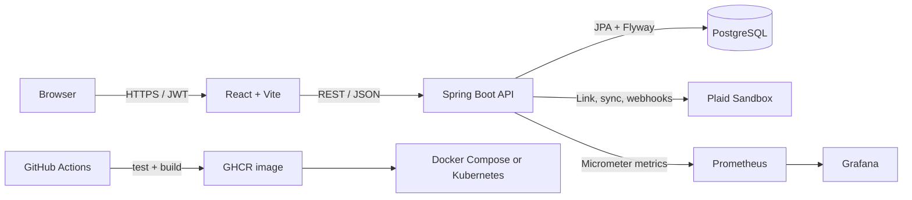

# SettleUp

SettleUp turns bank activity into shared expenses, balances, and a practical path back to even. Instead of asking everyone to enter every purchase by hand, it imports transactions through Plaid, identifies likely group expenses, and asks a person to confirm or reject each suggestion before money moves into a group ledger.

That review step is the important difference: detection removes repetitive entry, but people keep control when a merchant, amount, or category is ambiguous. Manual expenses remain available when a transaction is missing or cash was used.

[Watch the 90-second product tour](docs/settleup-demo.mp4)

## What it does

- Connects sandbox bank accounts and synchronizes transactions through Plaid
- Learns from merchant history, category, amount, confirmations, and rejections
- Supports equal, exact, and percentage expense splits with integer-cent accounting
- Shows group balances and suggests a compact set of payments to settle them
- Protects every user-scoped operation with signed access and refresh tokens
- Exposes health, metrics, structured logs, and correlation IDs for operations

## Architecture



The API owns authentication, authorization, transaction classification, expense validation, balance calculation, and settlement planning. PostgreSQL is the source of truth. The React client coordinates server state and keeps review decisions explicit. See [the architecture guide](docs/architecture.md) for request flows, trust boundaries, and deployment detail.

## Local setup

Docker Desktop, Node.js 22+, and Java 21 are required. Copy the example environment file and replace the JWT and encryption placeholders with separate random Base64 secrets; add Plaid Sandbox credentials to exercise bank flows.

```bash
git clone https://github.com/jason3012/got_you_next_time.git && cd got_you_next_time
cp .env.example .env
docker compose up --build -d
npm ci --prefix frontend && npm run frontend:dev
```

Open the client at <http://localhost:5173>, API documentation at <http://localhost:8080/swagger-ui.html>, and readiness status at <http://localhost:8080/actuator/health/readiness>.

## Why this stack

| Choice | Reason |
| --- | --- |
| Java 21 + Spring Boot 3 | Strong transaction boundaries, validation, security primitives, and production diagnostics for the financial core |
| PostgreSQL 16 + Flyway | Relational constraints and repeatable schema evolution suit groups, memberships, splits, and immutable money records |
| React + TypeScript + Vite | Typed component development, fast local feedback, and a small static deployment surface |
| Plaid Sandbox | A realistic account-link and transaction-sync contract without handling bank credentials directly |
| Docker + Kubernetes | One reproducible local stack and a portable path to health-checked, replicated deployment |
| Prometheus + Grafana | Low-friction collection and visualization of request, JVM, and database-pool behavior |

## Decisions worth defending

- **Money uses integer cents.** Arithmetic and persistence stay exact; presentation is the only place decimal currency formatting occurs.
- **Plaid access tokens are encrypted at rest.** A dedicated application key protects provider credentials independently from login-token signing.
- **Webhook processing is idempotent.** Persisted event identity prevents retries from importing the same activity twice.
- **Settlement planning is greedy.** Matching the largest debtors and creditors is fast, deterministic, and easy to explain. It minimizes transfers for common cases without claiming a globally minimal result for every possible balance set.
- **Classification keeps a person in the loop.** Only sufficiently confident transactions become suggestions, and confirmation is required before an expense affects balances. Rejections become negative feedback.

## Measured evidence

Measurements below were collected locally on September 22, 2026. Latency results describe the readiness endpoint on Docker Desktop on Apple Silicon; they are reproducible development evidence, not a production service-level objective.

| Measure | Result | Method |
| --- | ---: | --- |
| Backend test suite | 39 passing | `./mvnw verify` with PostgreSQL 16 Testcontainers |
| Core algorithm coverage | 89.2% lines, 74.7% branches | JaCoCo over classification, splitting, balances, and settlement planning |
| API image size | 263.5 MiB / 276,329,527 bytes | `docker image inspect settleup-api:latest` |
| Readiness throughput | 1,567 requests/second | 2,000 requests at concurrency 20 |
| Readiness p95 latency | 23 ms | ApacheBench local run, zero failed requests |
| Largest settlement group tested | 1,000 members | Exact-balance unit test producing 500 transfers |

Resume-ready summary:

- Built a full-stack expense-sharing system that converts synchronized bank activity into reviewed expenses, exact balances, and deterministic settlement plans.
- Shipped a non-root 263.5 MiB API image with 39 passing backend tests, 89.2% core algorithm line coverage, 23 ms local p95 readiness latency, and a verified 1,000-member settlement case.

## Verification

Run backend verification with Docker available:

```bash
cd backend
./mvnw verify
```

The HTML coverage report is written to `backend/target/site/jacoco/index.html`.

Run frontend checks from the repository root:

```bash
npm run frontend:lint
npm run frontend:build
```

Rebuild the product tour after updating its source screenshots or title cards:

```bash
./scripts/build-demo-video.sh
```

The script requires FFmpeg and `rsvg-convert` from librsvg.

## Deployment and operations

The production-shaped Docker Compose stack runs the non-root API image against PostgreSQL with health-gated startup. The local Kubernetes overlay adds two API replicas, persistent database storage, ingress, resource limits, metrics-server, horizontal scaling, Prometheus, and a provisioned Grafana dashboard.

Phase 14, the optional AWS/EKS deployment, is intentionally deferred. It can be added later as another deployment target because application configuration, container packaging, health probes, manifests, and observability are already separated from the cloud provider.

The GitHub Actions workflow tests pull requests, publishes the API image to GHCR, and supports an optional cluster deployment when credentials are configured. The root `vercel.json` deploys the frontend; set `VITE_API_URL` to the public HTTPS API before enabling authenticated product flows.

## Reference

- [API reference](docs/api.md)
- [Architecture and security decisions](docs/architecture.md)
- [Kubernetes runbook](docs/kubernetes.md)
- [Settlement algorithm](docs/settlement-algorithm.md)
- [Full build specification](settleup-build-spec.md)
