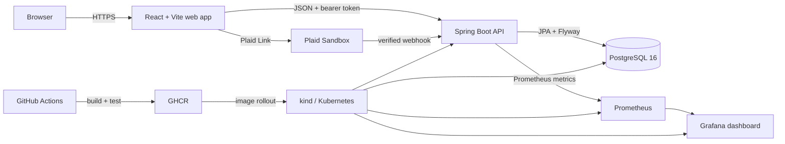

# SettleUp architecture

## System overview

The browser owns presentation and short-lived session state. The API is the authority for identity, membership, expenses, balances, settlements, bank connections, and classification decisions. PostgreSQL is the durable system of record. Plaid supplies bank data but never becomes the source of truth for a group expense until a person confirms or imports it.

## Request and data flows

### Authentication

1. Registration or login returns a signed access token, a signed refresh token, and the current user.
2. The web app sends the access token as `Authorization: Bearer <token>`.
3. On a `401`, the typed API client exchanges the refresh token once, stores the rotated pair, and retries the original request.
4. Spring Security resolves the user ID from the JWT. Protected endpoints never accept a caller-supplied user ID.

### Expense capture

1. A user creates an expense manually or selects a synced bank transaction.
2. The API validates membership, payer identity, amount, and split inputs.
3. `SplitCalculator` converts equal, exact, or percentage inputs into immutable cent-denominated shares.
4. The expense and its shares commit in one database transaction.
5. `BalanceCalculator` derives each member's current position from expenses and recorded settlements.

### Transaction suggestions

1. Plaid Link exchanges a temporary public token for an access token that is encrypted before storage.
2. Cursor-based sync upserts transactions idempotently; signed webhooks can request another sync.
3. Classification rules score merchant history, category history, and typical amount.
4. Only suggestions meeting the confidence floor enter the inbox.
5. A person confirms or rejects every suggestion. Rejections become negative feedback that suppresses repeated bad matches.

### Settlement planning

Balances use positive cents for creditors and negative cents for debtors. The planner keeps two priority queues and greedily matches the largest debtor with the largest creditor. It is deterministic and runs in `O(n log n + t log n)`, where `n` is the number of members and `t` is the number of transfers. This favors predictable, understandable output over solving the NP-hard minimum-transaction variant.

## Deployment shape

The production-shaped local environment uses a multi-stage, non-root API image. Kubernetes runs two API replicas behind nginx ingress, PostgreSQL on persistent storage, readiness/liveness probes, resource limits, and an HPA spanning two to five replicas. Prometheus discovers the API pods, and Grafana provisions the project dashboard automatically.

GitHub Actions runs frontend type checking/builds and the full backend suite on pull requests. Pushes to `main` publish the API image to GHCR. A deployment occurs only when a Kubernetes configuration secret is present.

## Security boundaries

- Passwords are BCrypt hashes; plaintext passwords are never stored.
- Access and refresh tokens are signed and type-scoped.
- Plaid access tokens are encrypted at rest with a separate application key.
- Plaid webhooks require signature verification before processing.
- Membership and administrative permissions are checked inside the service layer.
- The API container runs as UID/GID `10001`, drops Linux capabilities, and disallows privilege escalation.
- Logs are structured JSON and every response carries `X-Correlation-ID` for request tracing.

## Decisions worth defending

| Decision | Why | Trade-off |
|---|---|---|
| Store money as integer cents | Arithmetic stays exact and auditable. | Currency rules beyond two decimal places require a richer money model. |
| Encrypt Plaid tokens separately | A database disclosure alone does not expose bank credentials. | Key rotation must be handled operationally. |
| Make webhook processing idempotent | Plaid retries cannot duplicate imported state. | Persistence needs stable provider identifiers and upsert logic. |
| Use greedy settlement | Output is fast, deterministic, and easy to explain. | It does not guarantee the mathematically fewest transfers. |
| Keep classification human-in-the-loop | Automation reduces entry work without silently creating debt. | Users still review uncertain transactions. |

Phase 14 can later add an EKS overlay and Terraform infrastructure without changing these application boundaries. The local deployment remains the reference implementation until that optional paid phase is authorized.
